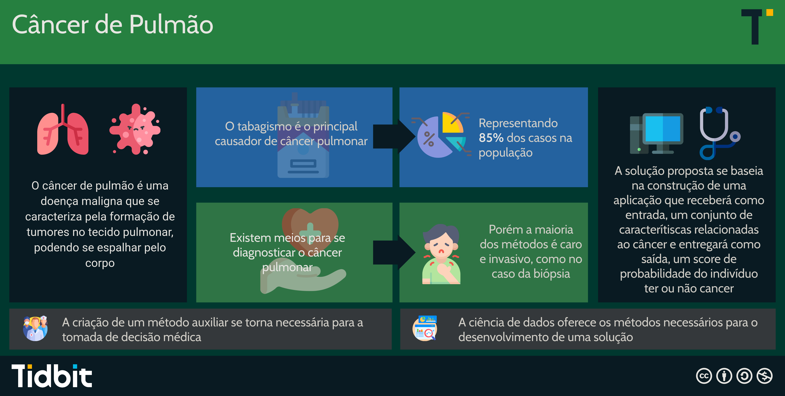

# Lung Cancer

## Resumo 
Sendo uma das doenças malignas que mais afeta a população, o câncer de pulmão é caracterizado por um crescimento desordenado das células do tecido pulmonar, dando origem a um tumor. O diagnóstico deste câncer pode ser realizado através de exames de imagem e biópsia, métodos geralmente caros e que podem ser invasivos. Por conta disso, se torna relevante a criação de um método auxiliar de baixo custo para a análise da predisposição que um indivíduo possui, afim de fornecer um auxílio na tomada de decisão médica. O objetivo do projeto é construir uma aplicação que receberá como entrada um conjunto de características de pacientes e entregará como saída, um score de probabilidade do indivíduo ter ou não câncer de pulmão. Utilizaremos o conjunto de dados [Lung Cancer](https://www.kaggle.com/datasets/nancyalaswad90/lung-cancer) para construção do projeto. 

### Resumo Gráfico

## Desenvolvedores

 - [Bárbara da Silva Oliveira](https://github.com/barbaraoliveira1415)
 - [Carlos André de Sousa Monteiro](https://github.com/CarlosAndre1977)
 - [Carlos Augusto Melo de Pinho](https://github.com/augustocarrlos10)
 - [Hugo Silveira Sousa](https://github.com/hugosousa111)
 - [Larissa Araújo Barbosa](https://github.com/Larissaab)
 - [Luiz Henrique Medeiros de Souza](https://github.com/Luizrev)
 - [Matheus Amorim Constancio](https://github.com/math-ac)
 - [Rafael Galdino da Silva](https://github.com/rafaelsilva81)